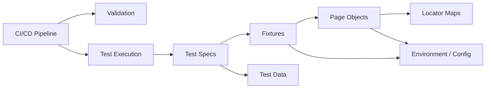
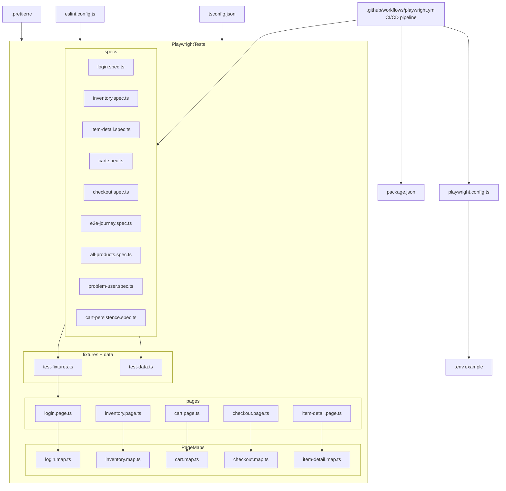

# 🧪 Playwright Framework — SauceDemo E2E Tests


Enterprise-grade **end-to-end test automation framework** for  
https://www.saucedemo.com built with **Playwright + TypeScript**.

Designed with **clean architecture, strong typing, CI/CD integration, and scalable test design**.

Repository: https://github.com/BrownBear9208/PlaywrightFramework

---

# 🏗 Architecture



### Architecture Layers

| Layer | Responsibility |
|------|---------------|
| Specs | Test scenarios and assertions |
| Fixtures | Dependency injection for page objects |
| Pages | Business actions on the UI |
| PageMaps | Locator definitions |
| Data | Centralized test data |
| Config | Environment configuration |

---

# 📁 Project Structure



---

# ⚙️ Setup

### Clone repository

```bash
git clone https://github.com/BrownBear9208/PlaywrightFramework.git
cd PlaywrightFramework
```

### Install dependencies

```bash
npm install
```

### Install Playwright browsers

```bash
npx playwright install
```

### Configure environment

```bash
cp .env.example .env
```

Edit `.env` if needed.

---

# 🧪 Run Tests

| Command | Description |
|------|-------------|
| `npm test` | Run all tests on all browsers |
| `npm run test:smoke` | Run smoke tests only (`@smoke`) |
| `npm run test:regression` | Run regression tests only (`@regression`) |
| `npm run test:e2e` | Run E2E journey tests |
| `npm run test:chromium` | Run tests on Chromium only |
| `npm run test:firefox` | Run tests on Firefox only |
| `npm run test:webkit` | Run tests on WebKit only |
| `npm run test:headed` | Run tests with visible browser |
| `npm run test:debug` | Run tests in Playwright debug mode |
| `npm run report` | Open the HTML test report |

---

# 🧹 Code Quality

| Command | Description |
|------|-------------|
| `npm run validate` | Run all checks (typecheck + lint + format) |
| `npm run typecheck` | TypeScript strict compilation check |
| `npm run lint` | ESLint static analysis |
| `npm run lint:fix` | ESLint auto-fix issues |
| `npm run format` | Prettier auto-format all files |
| `npm run format:check` | Prettier check without modifying files |

Pre-commit hooks (**Husky + lint-staged**) automatically run:

- ESLint
- Prettier

on staged `.ts` files before committing.

---

# 🚀 CI/CD Pipeline

GitHub Actions pipeline triggers on **push or pull request** to `main`.

### Pipeline Stages

```
VALIDATE
  │
  ▼
SMOKE
  │
  ▼
REGRESSION (parallel matrix)
```

### Browsers Tested

- Chromium
- Firefox
- WebKit

### Artifacts

| Artifact | Description | Retention |
|---------|-------------|----------|
| `playwright-report/` | HTML test report | 30 days |
| `test-results/` | traces, screenshots, videos | 30 days |

---

# 📊 Test Coverage Map

| Test ID Range | Spec File | Area | Count |
|------|-------------|------|------|
| TC-001 – 005 | `login.spec.ts` | Authentication | 5 |
| TC-100 – 133 | `inventory.spec.ts` | Product listing | 17 |
| TC-200 – 206 | `item-detail.spec.ts` | Product detail page | 7 |
| TC-300 – 306 | `cart.spec.ts` | Shopping cart | 7 |
| TC-400 – 422 | `checkout.spec.ts` | Checkout (3 phases) | 14 |
| TC-500 – 503 | `e2e-journey.spec.ts` | E2E purchase workflows | 4 |
| TC-600 – 611 | `all-products.spec.ts` | Full product catalog | 12 |
| TC-700 – 704 | `problem-user.spec.ts` | Known defect documentation | 5 |
| TC-800 – 804 | `cart-persistence.spec.ts` | Cart state persistence | 5 |

Total tests: **79+**

---

# 🧰 Tech Stack

| Tool | Purpose |
|-----|--------|
| Playwright | Browser automation |
| TypeScript | Type-safe test development |
| Node.js | Runtime |
| ESLint | Static analysis |
| Prettier | Code formatting |
| Husky | Git hooks |
| lint-staged | Pre-commit quality gates |
| dotenv | Environment configuration |
| GitHub Actions | CI/CD pipeline |

---

# 🔐 Environment Variables

| Variable | Default | Description |
|------|---------|-------------|
| `BASE_URL` | https://www.saucedemo.com | Application under test URL |
| `STANDARD_USER` | standard_user | Default login username |
| `STANDARD_PASSWORD` | secret_sauce | Default login password |
| `CI` | (not set) | Automatically set by GitHub Actions |

---

# 🧩 Design Patterns

- **Page Object Model (POM)**  
  Split into **PageMaps (locators)** and **Pages (actions)**

- **Custom Fixtures**  
  Page objects injected via `test.extend`

- **Test Tagging**  
  `@smoke` and `@regression` for selective execution

- **Data-Driven Testing**  
  Parameterized product catalog tests

- **Environment Abstraction**  
  `dotenv` + `process.env`
